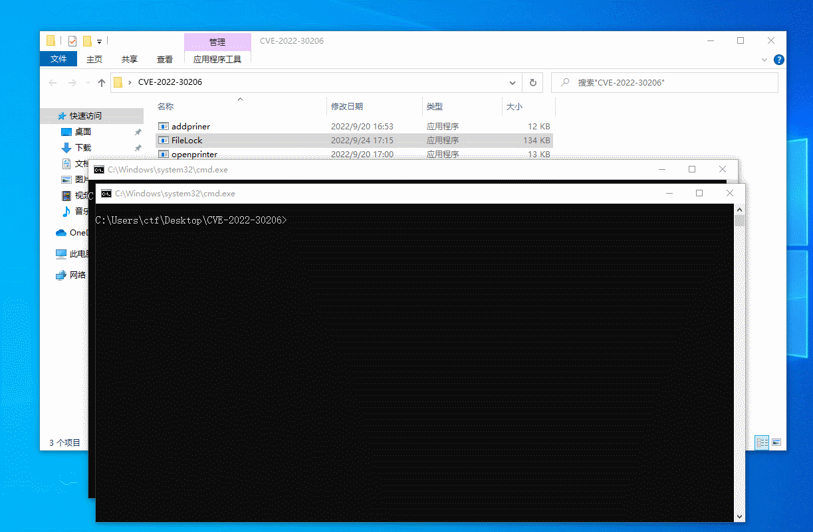

# CVE-2022-30206
This is the PoC for CVE-2022-30206.

## Introduction
Perform the following operations to arbitrary file deletion：
1. Run the `addprinter.exe` to create a printer and set the SpoolDirectory in `C:\Users\Public\tmp\1`.
2. Run the `FileLock.exe TargetFile` to redirect .SHD file to TargetFile and set a oplock on TargetFile.
3. Run the `openprinter.exe` to make the printer work, which will trigger the oplock, then release the oplock, the TargetFile will be deleted.

## PS
1. This PoC needs to be combined with some other tricks(such as <https://github.com/thezdi/PoC/tree/master/FilesystemEoPs>) to make arbitrary file deletion to achieve EoP
2. If the execution is not successful at one time, you need to modify the .SHD filename of the FileLock's main.cpp. Normally, the file id is incremented by two each time after a print job, please try 00005.SHD、00007.SHD…